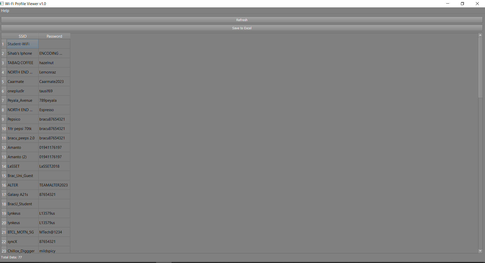
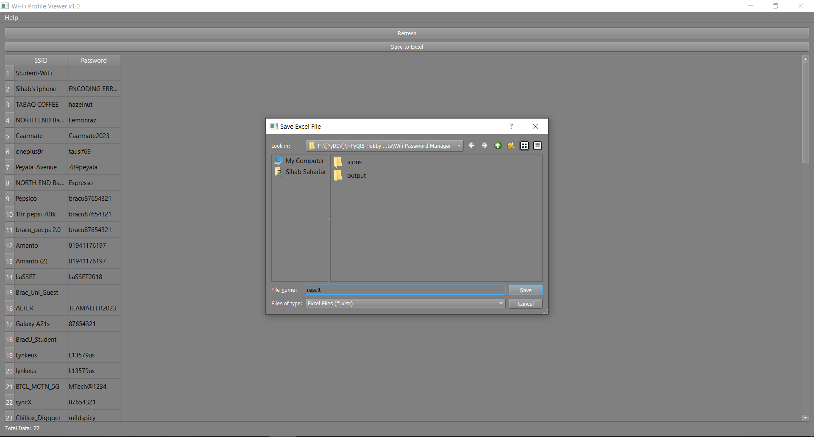

# Wi-Fi Profile Viewer

Wi-Fi Profile Viewer is a simple Python application built using PyQt5 that allows users to view and export Wi-Fi profiles on a Windows system. The application retrieves Wi-Fi SSIDs and passwords using `netsh` commands and provides a user-friendly interface for managing this information.

## Features

- **Profile Refresh:** Easily refresh Wi-Fi profiles with the click of a button.
- **Table View:** View Wi-Fi profiles in a table with SSID and password information.
- **Export to Excel:** Save Wi-Fi profiles to an Excel file for easy sharing and backup.

## Screenshots


*Caption: Main window with Wi-Fi profiles displayed in a table.*


*Caption:Exporting the table as printable format.*

## Technical Documentation

### Dependencies

- Python 3.x
- PyQt5
- pandas

### Running the Application

1. Install the required dependencies using the following command:
   ```bash
   pip install -r requirements.txt
2. Run the application using the following command:
   ```bash
   python wifi_profile_viewer.py
   
### Usage
- Refresh Profiles:
- Click the "Refresh" button to update the Wi-Fi profiles.
- Save to Excel: Click the "Save to Excel" button to export Wi-Fi profiles to an Excel file.
  
### Contributing
Feel free to contribute to the project by submitting issues or pull requests.

License
This project is licensed under the MIT License.

Author
[Sihab Sahariar]

